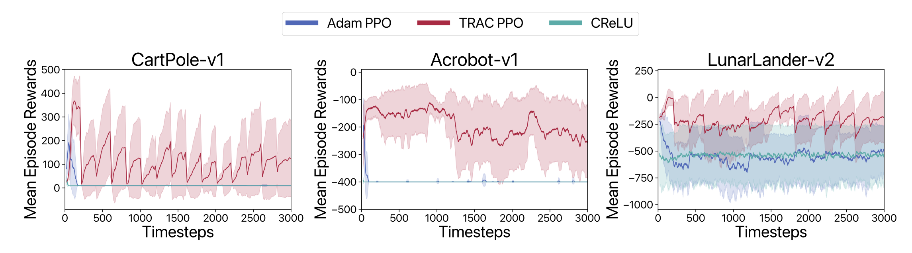

# PACE: Adaptive Parameter-free Optimization ⚡️
This repository is the official implementation of the **PACE** optimizer in ***Pick up the PACE: A Parameter-Free Optimizer for Lifelong Reinforcement Learning***.

**How can you _quickly_ adapt to new tasks or distribution shifts? Without knowing when or how difficult adaptation will be? And how to adapt without _ANY_ tuning?** 
 🤔💭

Well, we suggest you go fast. 🏎️💨 Go ahead and pick up (the) ''PACE.''

PACE is a parameter-free optimizer for continual environments inspired by [online convex optimization](https://arxiv.org/abs/1912.13213) and [discounted adaptive online learning](https://arxiv.org/abs/2402.02720).

## Implement with only one line change.
Like other [meta-tuners](https://openreview.net/pdf?id=uhKtQMn21D), PACE can work with any of your continual, fine-tuning, or lifelong experiments with just one line change.

```python
from pace import start_pace
# original optimizer
optimizer = torch.optim.Adam
lr = 0.001
optimizer = start_pace(log_file='logs/pace.text', optimizer)(model.parameters(), lr=lr)
```

After this modification, you can continue using your optimizer methods exactly as you did before. Whether it's calling `optimizer.step()` to update your model's parameters or `optimizer.zero_grad()` to clear gradients, everything stays the same. PACE seamlessly integrates into your existing workflow without any additional overhead.

## Requirements

To install the necessary dependencies, simply run:

```setup
pip install -r requirements.txt
```

## Control Experiments

We recommend running ``main.ipynb`` in Google Colab. This approach requires no setup, making it easy to get started with our control experiments.



## Vision-based RL Experiments

Coming soon ➡️
